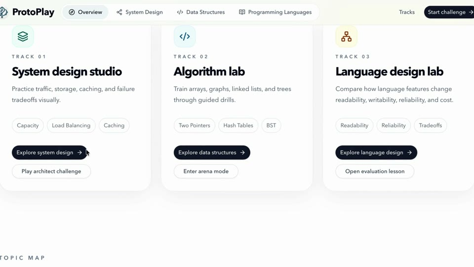
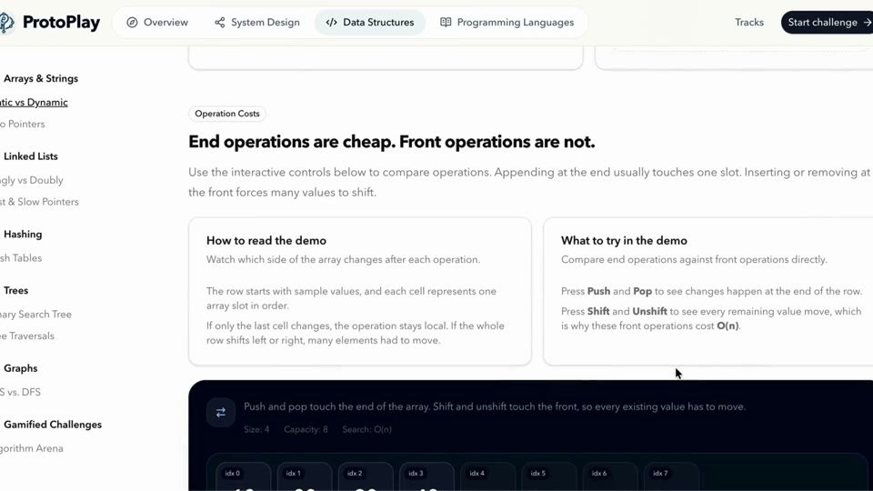

# ProtoPlay

<p>
  
  
  
  
  
</p>

ProtoPlay is a visual learning website for system design, data structures, and programming language concepts. It turns abstract engineering topics into interactive simulations, guided lessons, and challenge-based practice. The project focuses on helping learners understand architecture decisions, algorithm behavior, and tradeoffs through direct visual feedback.

---

## Demo

| System Design Studio | Data Structures Lab |
| --- | --- |
|  |  |

**Full demo:** [prototype-demo.mp4](public/prototype-demo.mp4)

---

## Project Structure

```text
System-Design/
├── public/
│   ├── demo-overview.jpg
│   ├── demo-data-structures.jpg
│   └── prototype-demo.mp4
├── src/
│   ├── app/
│   │   ├── layout.tsx
│   │   ├── page.tsx
│   │   └── (routes)/
│   ├── components/
│   │   ├── challenges/
│   │   ├── gamification/
│   │   ├── layout/
│   │   ├── lessons/
│   │   ├── ui/
│   │   └── visuals/
│   └── lib/
│       ├── gamification/
│       ├── topics.ts
│       └── systemDesignLessonContent.ts
├── package.json
└── README.md
```

---

## Frontend

| Area | Details |
| --- | --- |
| App shell | Next.js App Router with shared layout, route groups, and reusable navigation |
| UI system | Tailwind CSS, shadcn/ui primitives, Lucide icons, and responsive component layouts |
| Motion | Framer Motion transitions for interactive learning states and challenge feedback |
| Visuals | Custom React simulations for caching, load balancing, arrays, graphs, trees, queues, and language concepts |

---

## ML Pipeline

ProtoPlay does not currently ship with a trained machine learning model or inference service. Its learning pipeline is simulation-driven: curated concept content flows into interactive state models, visual components, scoring logic, and user feedback. If ML is added later, the clean component boundaries make it possible to connect model outputs to the existing visualization and challenge layers.

---

## Special Features

| Feature | What It Adds |
| --- | --- |
| System Architect Challenge | Lets learners design systems while balancing latency, reliability, and cost |
| Algorithm Arena | Turns data structure operations into guided visual puzzles |
| Interactive Lessons | Explains concepts with live diagrams instead of static notes |
| Real-Time Metrics | Shows how architecture choices affect simulated system behavior |
| Topic Tracks | Organizes content into system design, data structures, and programming languages |

---

## How It Works

1. Learners choose a track from the main ProtoPlay experience.
2. Each topic loads lesson content, visual components, and interaction rules from the app data layer.
3. Simulations update the interface in real time as users change inputs, complete challenges, or explore tradeoffs.
4. Gamified components provide progress feedback, challenge completion states, and concept reinforcement.

---

## Tech Stack

| Layer | Tools |
| --- | --- |
| Framework | Next.js 16, React 19 |
| Language | TypeScript |
| Styling | Tailwind CSS 4, shadcn/ui, tailwind-merge |
| Animation | Framer Motion |
| UI + Icons | Radix UI, Lucide React |
| Feedback | canvas-confetti, sonner |
| Tooling | ESLint, PostCSS |
